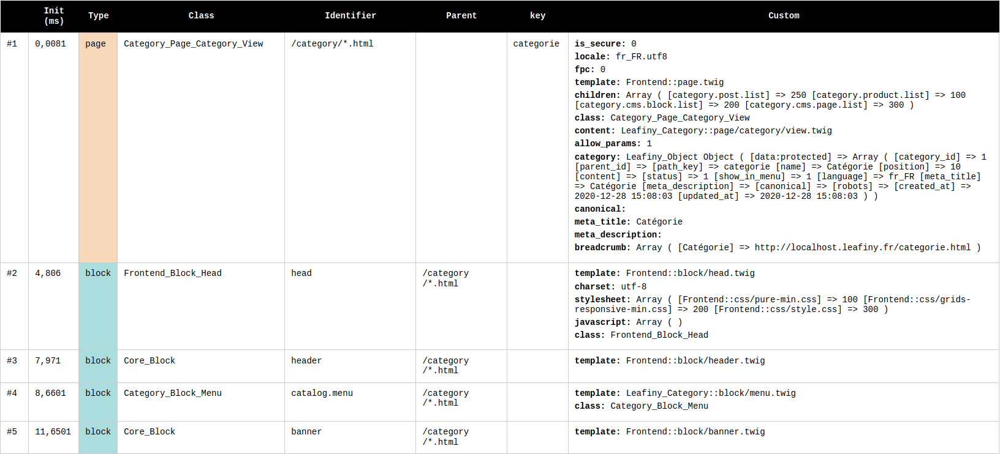

# Leafiny_Debug

The module add an HTML table at the end of the page with all queries executed and all objects loaded: page, block, model, helper...

All custom params are showed.



# Installation

Copy `Leafiny_Debug` into your Leafiny `modules` directory.

# Configuration

In global config file (ex: `etc/config.dev.php`), add **debug** key in **app** configuration:

```php
$config = [
    'app' => [
        /* ... */
        'debug' => 1,
    ],
    /* ... */
];
```

Filter object types with **debug_only** key (optional):

```php
$config = [
    'app' => [
        /* ... */
        'debug'      => 1,
        'debug_only' => ['page', 'block'],
    ],
    /* ... */
];
```